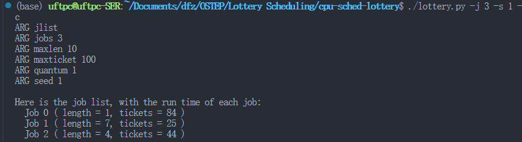
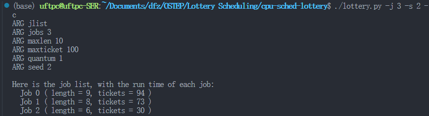
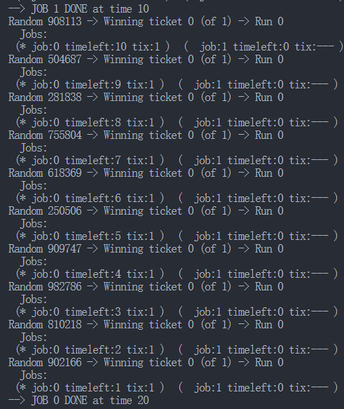
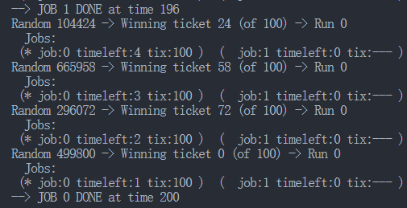

# Lottery Scheduling

# 使用说明

```cpp
prompt> ./lottery.py -h
Usage: lottery.py [options]

Options:
  -h, --help          
      show this help message and exit
  -s SEED, --seed=SEED  
      the random seed
  -j JOBS, --jobs=JOBS  
      number of jobs in the system
  -l JLIST, --jlist=JLIST
      instead of random jobs, provide a comma-separated list
      of run times and ticket values (e.g., 10:100,20:100
      would have two jobs with run-times of 10 and 20, each
      with 100 tickets)
  -m MAXLEN, --maxlen=MAXLEN
      max length of job
  -T MAXTICKET, --maxtick=MAXTICKET
      maximum ticket value, if randomly assigned
  -q QUANTUM, --quantum=QUANTUM
      length of time slice
  -c, --compute
      compute answers for me
```

-j 任务数量

-l 任务队列（运行事件+票数）

-q 时间片长度

# 答案

1. 计算3个工作在随机种子为1、2和3时的模拟解。

    > ​​
    >
    > ​​
    >
    > ​​
    >

2. 现在运行两个具体的工作：每个长度为10，但是一个（工作0）只有一张彩票，另一个（工作1）有100张（−l 10∶1,10∶100）。  
    彩票数量如此不平衡时会发生什么？在工作1完成之前，工作0是否会运行？多久？一般来说，这种彩票不平衡对彩票调度的行为有什么影响？

    > ​​
    >
    > 可能导致有的程序被饿死
    >

3. 如果运行两个长度为100的工作，都有100张彩票（−l100∶100,100∶100），调度程序有多不公平？运行一些不同的随机种子来确定（概率上的）答案。不公平性取决于一项工作比另一项工作早完成多少。

    > ​​
    >
4. 随着量子规模（-q）变大，你对上一个问题的答案如何改变？

    > 时间片越大，说明每个任务能够更快完成，降低了随机性，不公平性会增强
    >
