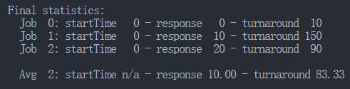
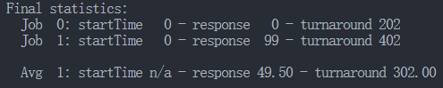

# MLFQ Scheduling

# 使用说明

```cpp
Usage: mlfq.py [options]

Options:
  -h, --help            show this help message and exit
  -s SEED, --seed=SEED  the random seed
  -n NUMQUEUES, --numQueues=NUMQUEUES
                        number of queues in MLFQ (if not using -Q)
  -q QUANTUM, --quantum=QUANTUM
                        length of time slice (if not using -Q)
  -a ALLOTMENT, --allotment=ALLOTMENT
                        length of allotment (if not using -A)
  -Q QUANTUMLIST, --quantumList=QUANTUMLIST
                        length of time slice per queue level, specified as
                        x,y,z,... where x is the quantum length for the
                        highest priority queue, y the next highest, and so
                        forth
  -A ALLOTMENTLIST, --allotmentList=ALLOTMENTLIST
                        length of time allotment per queue level, specified as
                        x,y,z,... where x is the # of time slices for the
                        highest priority queue, y the next highest, and so
                        forth
  -j NUMJOBS, --numJobs=NUMJOBS
                        number of jobs in the system
  -m MAXLEN, --maxlen=MAXLEN
                        max run-time of a job (if randomly generating)
  -M MAXIO, --maxio=MAXIO
                        max I/O frequency of a job (if randomly generating)
  -B BOOST, --boost=BOOST
                        how often to boost the priority of all jobs back to
                        high priority
  -i IOTIME, --iotime=IOTIME
                        how long an I/O should last (fixed constant)
  -S, --stay            reset and stay at same priority level when issuing I/O
  -I, --iobump          if specified, jobs that finished I/O move immediately
                        to front of current queue
  -l JLIST, --jlist=JLIST
                        a comma-separated list of jobs to run, in the form
                        x1,y1,z1:x2,y2,z2:... where x is start time, y is run
                        time, and z is how often the job issues an I/O request
  -c                    compute answers for me
```

-n 队列数量，与-Q冲突

-q 时间片长度，与-Q冲突

-a 时间配额用于降级，与-Q冲突

-Q 不同优先级任务时间片长度

-A 时间配额，用于降级，最后一个没用

-j 任务数量

-m 任务运行最久时间（占用CPU？）

-M IO时间频率

-B 提高优先级时间

-i IO操作执行时间

-S 执行IO操作期间任务保持相同优先级（配额reset）

-I IO执行完毕后立刻回到队首

-l 队列：开始时间 + 运行时间 + IO操作频率

1. ​`prompt> ./mlfq.py -j 3 -i 4`​

    > Final statistics:  
    >   Job  0: startTime   0 - response   0 - turnaround 181  
    >   Job  1: startTime   0 - response   7 - turnaround 162  
    >   Job  2: startTime   0 - response  10 - turnaround 163
    >
    >   Avg  2: startTime n/a - response 5.67 - turnaround 168.67
    >

# 问题

1. 只用两个工作和两个队列运行几个随机生成的问题。针对每个工作计算MLFQ的执行录。限制每项作业的长度并关闭I/O，让你的生活更轻松。

    > ./mlfq.py -n 2 -j 2 -l 0,10,0:0,100,0:0,40,0 -c
    >
    > ​​
    >

3. 将如何配置调度程序参数，像轮转调度程序那样工作？

    > ./mlfq.py -n 1 -q 1 -q 1 -l 0,10,0:0,10,0:0,10,0
    >

4. 设计两个工作的负载和调度程序参数，以便一个工作利用较早的规则4a和4b（用-S标志打开）来“愚弄”调度程序，在特定的时间间隔内获得99%的CPU。

    > ./mlfq.py -S -n 2 -q 100 -a 100 -i 1 -l 0,200,99:0,200,99 -I -c
    >
    > ​​
    >

5. 给定一个系统，其最高队列中的时间片长度为10ms，你需要如何频繁地将工作推回到最高优先级级别（带有-B标志），以保证一个长时间运行（并可能饥饿）的工作得到至少5%的CPU？

    > 问题分析：假设系统中不会有新的任务进入。需要保证每20个时间片必能轮到一次，boost time 200ms。
    >
    > 那么这个系统的任务是什么样子的呢？可以把问题想的简单一点，只考虑一层时，最多20个任务
    >
    > 假设这个长期CPU运行的任务，刚刚运行完毕，那么他会下降一层
    >
    > 因此，在只有两层的情况下回事什么样子呢
    >
    > 突发奇想，直觉上，也许要保证平均10个时间片？
    >
    > 所以这个系统肯定不能无限新增高优先级任务
    >
    > 原理上，高优先级任务未执行完毕，低优先级任务会被饿死，为了防止饿死，一定会在优先级重排列时，把低优先级的任务放在最前面？
    >
    > 考虑到其他任务，如果在我们考虑的这个任务执行完，降低优先级后，还有任务未执行完毕的话，说明如果要保证监控任务下次任务执，需要把遗留任务执行一遍，也就是保证任务数量是20个以内
    >
6. 调度中有一个问题，即刚完成I/O的作业添加在队列的哪一端。-I标志改变了这个调度模拟器的这方面行为。尝试一些工作负载，看看你是否能看到这个标志的效果

    > ./mlfq.py -S -n 2 -q 100 -a 100 -i 1 -l 0,200,99:0,200,99 -I -c
    >
    > 放在任务队列最前端
    >

‍
