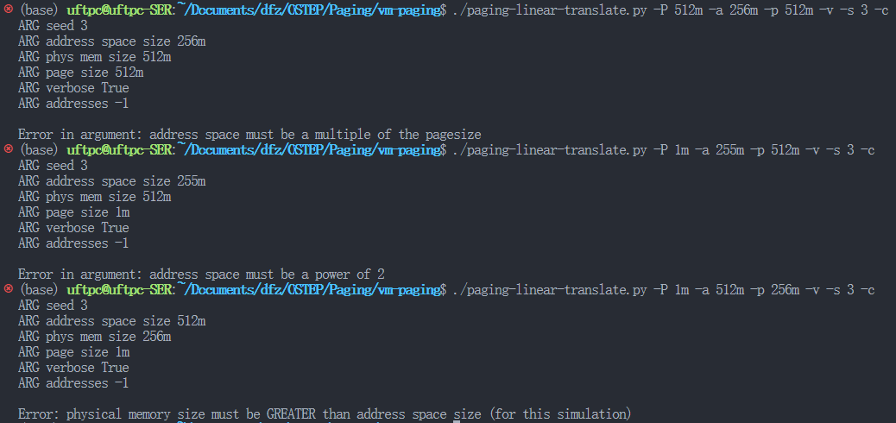

# Paging

# 使用说明

```cpp
prompt> ./paging-linear-translate.py -h
Usage: paging-linear-translate.py [options]

Options:
-h, --help              show this help message and exit
-s SEED, --seed=SEED    the random seed
-a ASIZE, --asize=ASIZE 
                        address space size (e.g., 16, 64k, ...)
-p PSIZE, --physmem=PSIZE
                        physical memory size (e.g., 16, 64k, ...)
-P PAGESIZE, --pagesize=PAGESIZE
                        page size (e.g., 4k, 8k, ...)
-n NUM, --addresses=NUM number of virtual addresses to generate
-u USED, --used=USED    percent of address space that is used
-v                      verbose mode
-c                      compute answers for me
```

-a 虚拟地址空间大小

-p 物理地址空间大小

-P 页大小

-n 测试用例数量

-u 已使用地址空间占比

-v 冗余模式，是否打印VPN

## 注释

1. 每个进程被分配1个页表
2. 虚拟页VPN，物理页PFN
3. 页表项PTE，最高位代表页是否可用，低位代表PFN

# 答案

1. 在做地址转换之前，让我们用模拟器来研究线性页表在给定不同参数的情况下如何改变大小。在不同参数变化时，计算线性页表的大小。一些建议输入如下，通过使用-v标志，你可以看到填充了多少个页表项。

    > 1. 首先，要理解线性页表大小如何随着地址空间的增长而变化：
    >
    >     答案：线性页表大小 = -a选项 / -P选项
    > 2. 然后，理解线性页面大小如何随页大小的增长而变化：
    >
    >     答案：页大小和页表大小呈负相关
    > 3. 页表大小如何随地址空间的增长而改变？随着页大小的增长呢？为什么一般来说，我们不应该使用很大的页呢？
    >
    >     页表大小与虚拟地址空间呈正相关，与页大小呈负相关
    >
    >     页过大，容易导致内部碎片存在，同时灵活性降低
    >
2. 现在让我们做一些地址转换。从一些小例子开始，使用-u标志更改分配给地址空间的页数。如果增加每个地址空间中的页的百分比，会发生什么？

    > 答案：内存命中/可用比例逐渐增加
    >
3. 现在让我们尝试一些不同的随机种子，以及一些不同的（有时相当疯狂的）地址空间参数，哪些参数组合是不现实的？为什么？
4. 利用该程序尝试其他一些问题。你能找到让程序无法工作的限制吗？例如，如果地址空间大小大于物理内存，会发生什么情况？

    > 答案：-P -a -p 选项均为2次幂
    >
    > ​​
    >

‍
