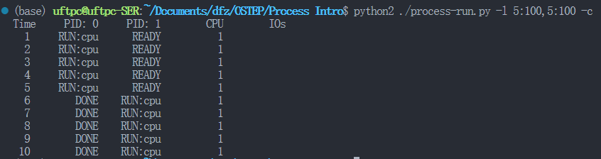
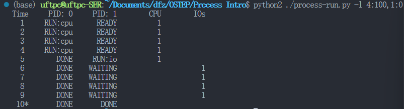
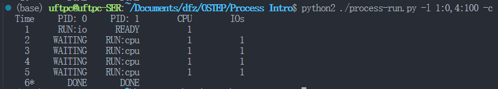
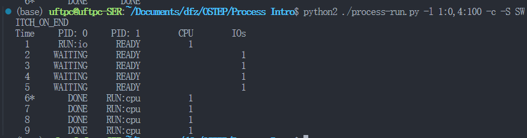
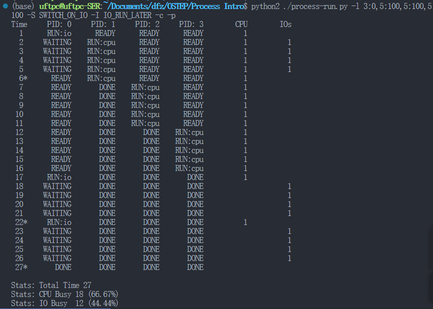
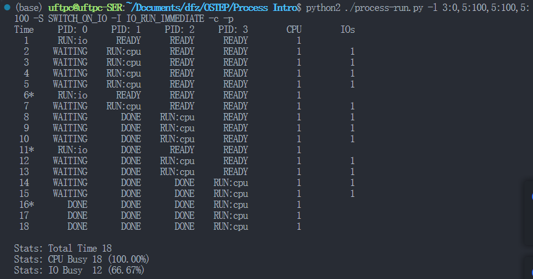

# Process Intro

# 问题

1. 用以下标志运行程序：./process-run.py -l 5:100,5:100。CPU 利用率（CPU 使用时间百分比）应该是多少？为什么你知道这一点？利用 -c 标记查看你的答案是否正确。

    > ```cpp
    >   -l PROCESS_LIST, --processlist=PROCESS_LIST
    >                         a comma-separated list of processes to run, in the
    >                         form X1:Y1,X2:Y2,... where X is the number of
    >                         instructions that process should run, and Y the
    >                         chances (from 0 to 100) that an instruction will use
    >                         the CPU or issue an IO
    > ```
    >
    > X1:Y1表征进程信息中的指令数和CPU指令概率，5:100,5:100代表两个进程AB，都运行5条CPU指令，执行结果如下：
    >
    > ​​
    >
2. 现在用这些标志运行：./process-run.py -l 4:100,1:0。这些标志指定了一个包含 4 条指令的进程（都要使用 CPU），并且只是简单地发出 I/O 并等待它完成。完成这两个进程需要多长时间？利用-c 检查你的答案是否正确。

    > ​​
    >
3. 现在交换进程的顺序：./process-run.py -l 1:0,4:100。现在发生了什么？交换顺序是否重要？为什么？同样，用-c 看看你的答案是否正确。

    > ​​
    >
4. 现在探索另一些标志。一个重要的标志是-S，它决定了当进程发出 I/O 时系统如何  
    反应。将标志设置为 SWITCH_ON_END，在进程进行 I/O 操作时，系统将不会切换到另一个进程，而是等待进程完成。当你运行以下两个进程时，会发生什么情况？一个执行 I/O，另一个执行 CPU 工作。（-l 1:0,4:100 -c -S SWITCH_ON_END）

    > 确定进程切换时机，IO事件切换还是进程DONE后切换
    >
    > ​​
    >
5. 现在，运行相同的进程，但切换行为设置，在等待I/O 时切换到另一个进程（-l 1:0,4:100 -c -S SWITCH_ON_IO）。现在会发生什么？利用-c 来确认你的答案是否正确

    > 同3，说明SWITCH_ON_IO为默认行为
    >
6. 另一个重要的行为是 I/O 完成时要做什么。利用-I IO_RUN_LATER，当 I/O 完成时，发出它的进程不一定马上运行。相反，当时运行的进程一直运行。当你运行这个进程组合时会发生什么？（./process-run.py -l 3:0,5:100,5:100,5:100 -S SWITCH_ON_IO -I IO_RUN_LATER -c -p）系统资源是否被有效利用？

    > ​​
    >
    > ​​
    >
    > 通过测试结果可知，立即执行IO任务会提高CPU利用效率
    >
7. 现在运行相同的进程，但使用-I IO_RUN_IMMEDIATE 设置，该设置立即运行发出  
    I/O 的进程。这种行为有何不同？为什么运行一个刚刚完成 I/O 的进程会是一个好主意？

    > 参考6结果，如果不立即执行IO指令而执行CPU指令，会造成后续IO指令阻塞时，CPU无事可做
    >
8. 现在运行一些随机生成的进程，例如-s 1 -l 3:50,3:50, -s 2 -l 3:50,3:50, -s 3 -l 3:50,3:50。看看你是否能预测追踪记录会如何变化？当你使用-I IO_RUN_IMMEDIATE 与-I IO_RUN_LATER 时会发生什么？当你使用-S SWITCH_ON_IO 与-S SWITCH_ON_END 时会发生什么？

    > 总结：操作系统倾向于优先执行IO指令，在IO阻塞期间执行CPU指令。
    >

‍
