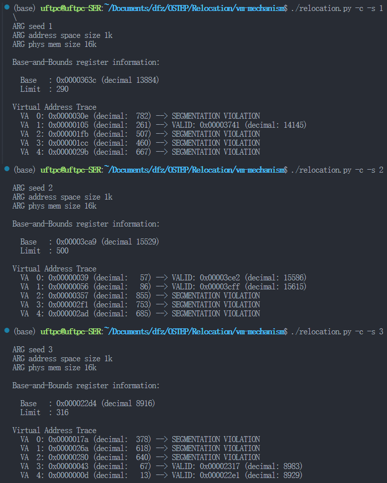
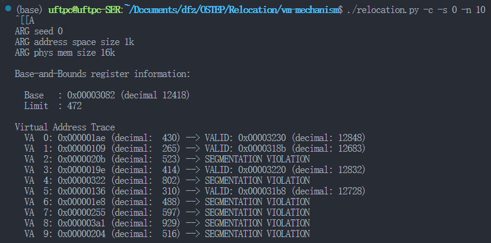
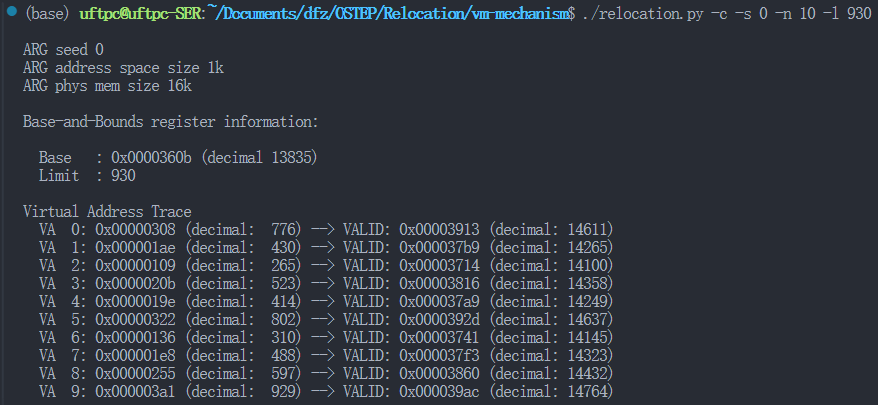
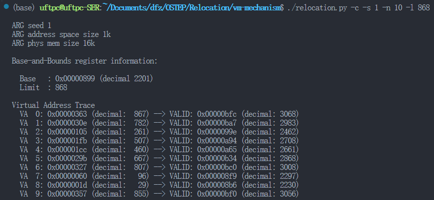
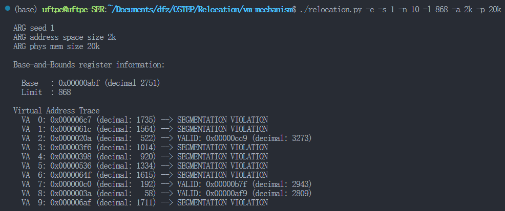

# Relocation

# 使用说明

```cpp
prompt> ./relocation.py -h
Usage: relocation.py [options]

Options:
  -h, --help            show this help message and exit
  -s SEED, --seed=SEED  the random seed
  -a ASIZE, --asize=ASIZE address space size (e.g., 16, 64k, 32m)
  -p PSIZE, --physmem=PSIZE physical memory size (e.g., 16, 64k)
  -n NUM, --addresses=NUM # of virtual addresses to generate
  -b BASE, --b=BASE     value of base register
  -l LIMIT, --l=LIMIT   value of limit register
  -c, --compute         compute answers for me
```

-b 内存基地址寄存器

-l 内存界限寄存器

-a 程序内存空间大小

-p 物理内存空间大小

-n 内存访问测试用例数量

# 课后问题

1. 用种子1、2和3运行，并计算进程生成的每个虚拟地址是处于界限内还是界限外?如果在界限内，请计算地址转换。

    ​​
2. 使用以下标志运行：-s 0 -n 10。为了确保所有生成的虚拟地址都处于边界内，要将-l（界限寄存器）设置为什么值？

    ​​

    ​​
3. 使用以下标志运行：-s 1 -n 10 -l 100。可以设置界限的最大值是多少，以便地址空间仍然完全放在物理内存中？

    ​​
4. 运行和第3题相同的操作，但使用较大的地址空间（-a）和物理内存（-p）

    ​​
5. 作为边界寄存器的值的函数，随机生成的虚拟地址的哪一部分是有效的？画一个图，使用不同随机种子运行，限制值从0到最大地址空间大小。

    > 我理解，题干的意思是，随机值用于生成边界寄存器数值？好像不对，没看懂题，跳过！
    >

‍
