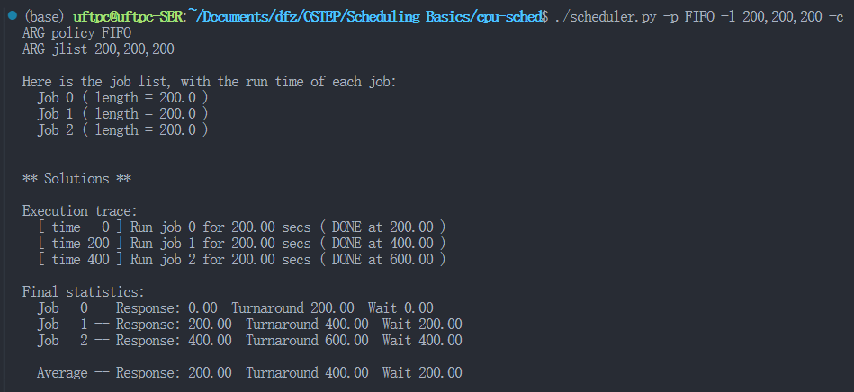
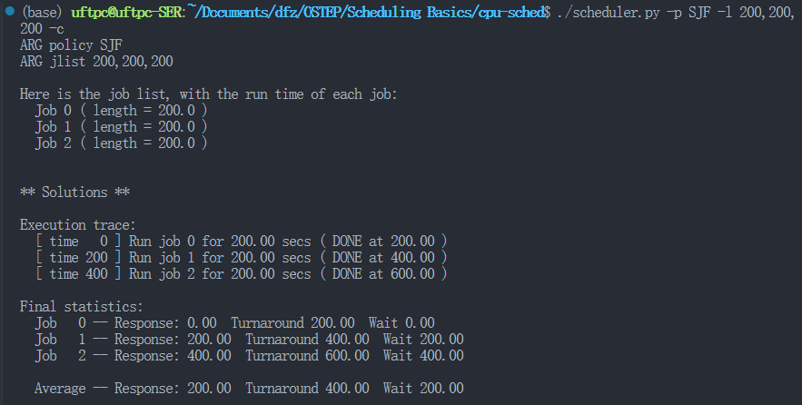
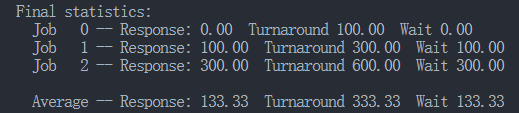
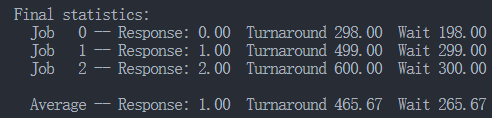

# Scheduling Basics

# 使用说明

> Usage: scheduler.py [options]
>
> Options:  
>   -h, --help            show this help message and exit  
>   -s SEED, --seed=SEED  the random seed  
>   -j JOBS, --jobs=JOBS  number of jobs in the system  
>   -l JLIST, --jlist=JLIST  
>                         instead of random jobs, provide a comma-separated list  
>                         of run times  
>   -m MAXLEN, --maxlen=MAXLEN  
>                         max length of job  
>   -p POLICY, --policy=POLICY  
>                         sched policy to use: SJF, FIFO, RR  
>   -q QUANTUM, --quantum=QUANTUM  
>                         length of time slice for RR policy  
>   -c                    compute answers for me

-j -s 配合使用，生成随机数量进程

-p 是调度策略 SJF最短时间 FIFO先入先出 RR轮转

-c 输出结果

-l 设置特定执行时间的进程

# 问题

1. 使用SJF和FIFO调度程序运行长度为200的3个作业时，计算响应时间和周转时间。

    > ​​​
    >
2. 现在做同样的事情，但有不同长度的作业，即100、200和300

    > ​​
    >
    > 省流，100，200，300按照循序执行，结果一样
    >
3. RR

    > ​​
    >
4. 对于什么类型的工作负载，SJF提供与FIFO相同的周转时间？

    > 对于按照从小到大排布顺序进入的进程
    >

5. 对于什么类型的工作负载和量子长度，SJF与RR提供相同的响应时间

    > 进程等长且时长等于时间片
    >
6. 随着工作长度的增加，SJF的响应时间会怎样？你能使用模拟程序来展示趋势吗？

    > 肯定是越来越长呀
    >
7. 随着量子长度的增加，RR的响应时间会怎样？你能写出一个方程，计算给定N个工作时，最坏情况的响应时间吗？

    > （1）随着时间片增加，RR响应时间增加
    >
    > （2）（N-1）* 量子
    >

‍
