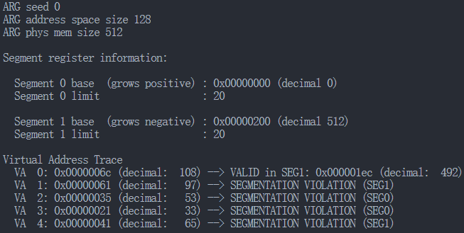
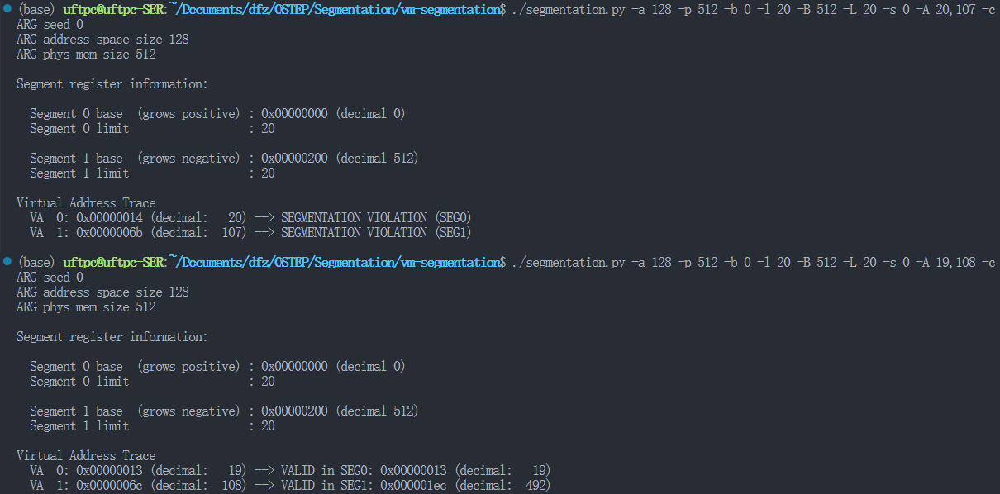
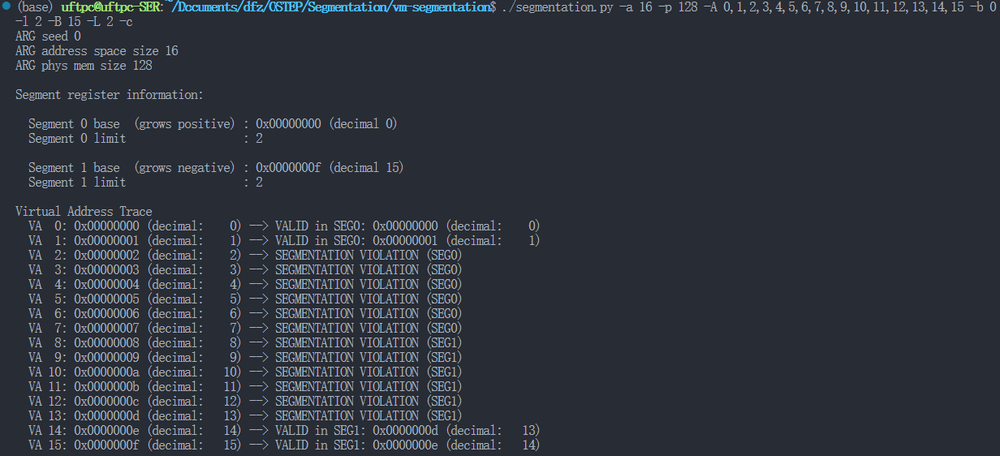
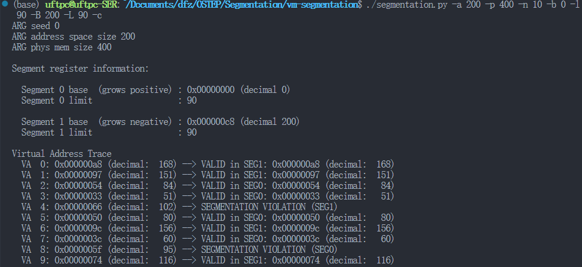

# Segmentation

# 使用方法

> ```cpp
> --------------- virtual address 0
>  |    seg0     |
>  |             |
>  |             |
>  |-------------|
>  |             |
>  |             |
>  |             |
>  |             |
>  |(unallocated)|
>  |             |
>  |             |
>  |             |
>  |-------------|
>  |             |
>  |    seg1     |
>  |-------------| virtual address max (size of address space)
> ```

物理内存被建模为两个段seg0，seg0从低地址向高地址增长，seg1从高地址向低地址增长

> Usage: segmentation.py [options]
>
> Options:  
>   -h, --help            show this help message and exit  
>   -s SEED, --seed=SEED  the random seed  
>   -A ADDRESSES, --addresses=ADDRESSES  
>                         a set of comma-separated pages to access; -1 means  
>                         randomly generate  
>   -a ASIZE, --asize=ASIZE  
>                         address space size (e.g., 16, 64k, 32m, 1g)  
>   -p PSIZE, --physmem=PSIZE  
>                         physical memory size (e.g., 16, 64k, 32m, 1g)  
>   -n NUM, --numaddrs=NUM  
>                         number of virtual addresses to generate  
>   -b BASE0, --b0=BASE0  value of segment 0 base register  
>   -l LEN0, --l0=LEN0    value of segment 0 limit register  
>   -B BASE1, --b1=BASE1  value of segment 1 base register  
>   -L LEN1, --l1=LEN1    value of segment 1 limit register  
>   -c                    compute answers for me

-A 用逗号分割的地址

-a 地址空间大小（进程最大内存消耗？）

-p 物理地址大小

-n 虚拟地址生成个数

-b/B 段基址寄存器值

-l/L 段界限寄存器值

通过测试，段0大小 = 段1大小（默认情况），假设内存中只有独立进程

# 答案

1. 先让我们用一个小地址空间来转换一些地址。这里有一组简单的参数和几个不同随机种子。你可以转换这些地址吗？

    segmentation.py -a 128 -p 512 -b 0 -l 20 -B 512 -L 20 -s 0

    > 虚拟地址空间 128；物理地址空间 512；段0 基址0 界限 20；段1 基址 512 界限 20
    >
    > ​​
    >

2. 现在，让我们看看是否理解了这个构建的小地址空间（使用上面问题的参数）。段0中最高的合法虚拟地址是什么？段1中最低的合法虚拟地址是什么？在整个地址空间中，最低和最高的非法地址是什么？最后，如何运行带有-A标志的segmentation.py来测试你是否正确

    > 19 108 20 492
    >
    > ​​
    >

3. 假设我们在一个128字节的物理内存中有一个很小的16字节地址空间。你会设置什么样的基址和界限，以便让模拟器为指定的地址流生成以下转换结果：有效，有效，违反……违反，有效，有效？假设用以下参数：

    segmentation.py -a 16 -p 128  
    -A 0,1,2,3,4,5,6,7,8,9,10,11,12,13,14,15  
    --b0 ? --l0 ? --b1 ? --l1 ?

    > ​​
    >

4. 假设我们想要生成一个问题，其中大约90%的随机生成的虚拟地址是有效的（即不产生段异常）。你应该如何配置模拟器来做到这一点？哪些参数很重要？

    > ​​
    >
    > l + L = 0.9 * a
    >

5. 你可以运行模拟器，使所有虚拟地址无效吗？怎么做到？

    > -l 0 -L 0
    >
