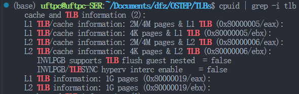
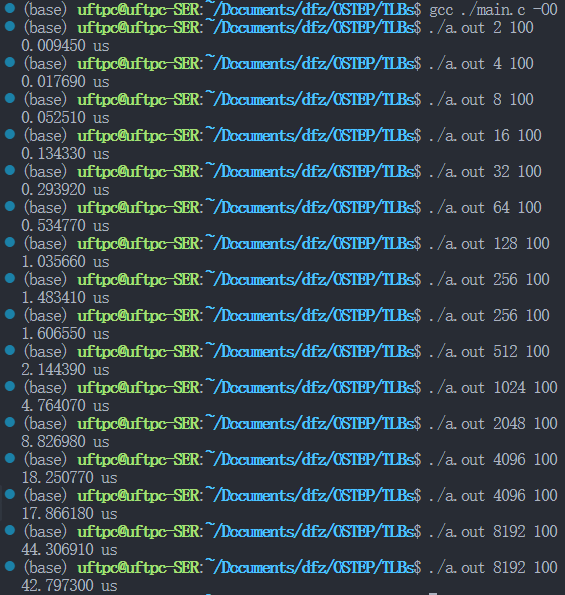
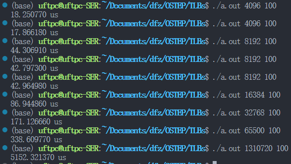
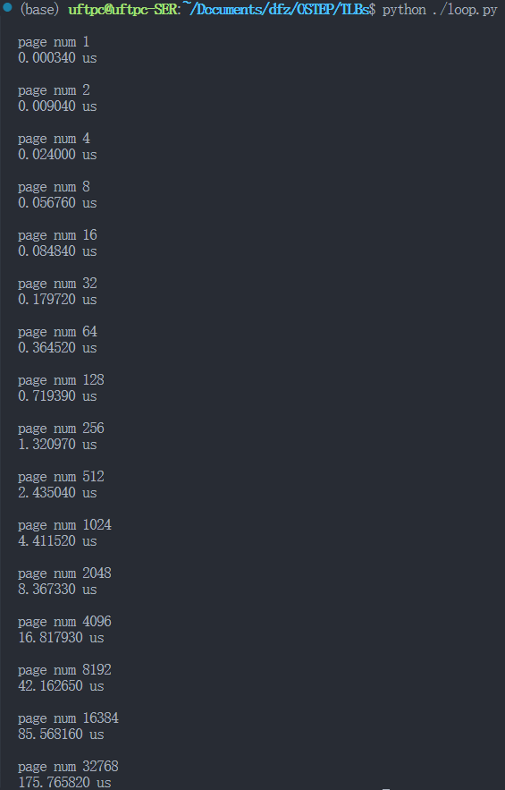
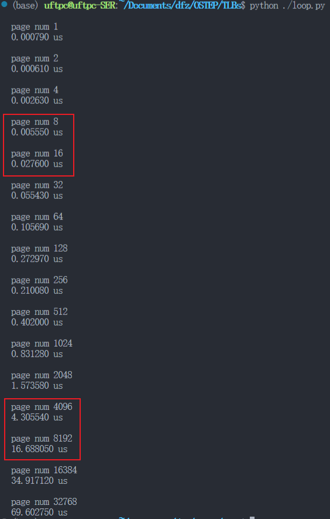

# TLBs

1. 为了计时，可能需要一个计时器，例如gettimeofday()提供的。这种计时器的精度如何？操作要花多少时间，才能让你对它精确计时？（这有助于确定需要循环多少次，反复访问内存页，才能对它成功计时。）

    ```cpp
    #include <stdio.h>
    #include <sys/time.h>
    #include <threads.h>

    int main() {
      struct timeval start, end;
      double elapsed_time;

      gettimeofday(&start, NULL);

      struct timespec duration;
      duration.tv_sec = 1;
      duration.tv_nsec = 0;
      thrd_sleep(&duration, NULL);

      gettimeofday(&end, NULL);

      elapsed_time =
          (end.tv_sec - start.tv_sec) + (end.tv_usec - start.tv_usec) * 1e-6;

      printf("Elapsed time: %f seconds\n", elapsed_time);

      return 0;
    }
    ```

    us级别精度，可能10us比较好
2. 写一个程序，命名为tlb.c，大体测算一下每个页的平均访问时间。程序的输入参数有：页的数目和尝试的次数

    > ​​
    >
    > 现代CPU的TLB设计比较复杂，测试结果重复性一般，TLB-L1缓存大概16-32MB
    >
    > ​​
    >
    > TLB-L2缓存大概256-512MB，处理速度上，L2和L1相差小于两倍
    >
    > ​​
    >
    > ​​
    >
    > (base) uftpc@uftpc-SER:~/Documents/dfz/OSTEP/TLBs$ cpuid | grep -i tlb  
    >    cache and TLB information (2):  
    >    L1 TLB/cache information: 2M/4M pages & L1 TLB (0x80000005/eax):  
    >    L1 TLB/cache information: 4K pages & L1 TLB (0x80000005/ebx):  
    >    L2 TLB/cache information: 2M/4M pages & L2 TLB (0x80000006/eax):  
    >    L2 TLB/cache information: 4K pages & L2 TLB (0x80000006/ebx):  
    >       INVLPGB supports TLB flush guest nested  = false  
    >       INVLPGB/TLBSYNC hyperv interc enable    = false  
    >    L1 TLB information: 1G pages (0x80000019/eax):  
    >    L2 TLB information: 1G pages (0x80000019/ebx):  
    > ……  
    > (base) uftpc@uftpc-SER:~/Documents/dfz/OSTEP/TLBs$ cpuid -r -l 5  
    > CPU 0:  
    >    0x00000005 0x00: eax=0x00000040 ebx=0x00000040 ecx=0x00000003 edx=0x00000011  
    > ……
    >
    > 使用命令查询，大概是0x00000040=64MB……
    >

5. 要注意编译器优化带来的影响。编译器做各种聪明的事情，包括优化掉循环，如果循环中增加的变量后续没有使用。如何确保编译器不优化掉你写的TLB大小测算程序的主循环？

    > GCC -O0
    >

6. 还有一个需要注意的地方，今天的计算机系统大多有多个CPU，每个CPU当然有自己的TLB结构。为了得到准确的测量数据，我们需要只在一个CPU上运行程序，避免调度器把进程从一个CPU调度到另一个去运行。如何做到？（提示：在Google上搜索“pinning a thread”相关的信息）如果没有这样做，代码从一个CPU移到了另一个，会发生什么情况？

    > 编译器不优化，同时在程序运行时绑定核心
    >

7. 另一个可能发生的问题与初始化有关。如果在访问数组a之前没有初始化，第一次访问将非常耗时，由于初始访问开销，比如要求置0。这会影响你的代码及其计时吗？如何抵消这些潜在的开销？

    > 增加数组初始化前后时间对比如下，可以发现增加初始化后，速度提升非常明显
    >
    > ​​​
    >

    > 来自大数据模型
    >
    > 如果在访问数组 `a`​ 之前没有进行初始化，第一次访问可能会非常耗时的原因通常与以下几个因素有关：
    >
    > 1. **内存分配**：如果数组 `a`​ 是一个静态或全局数组，它可能会在程序的生命周期内一直存在。但是，如果它是一个动态分配的数组（例如，使用 `malloc`​ 或 `new`​），并且没有正确初始化，那么第一次访问可能会涉及到内存的分配和页面的建立，这可能需要额外的时间。
    > 2. **缺页异常**：在现代操作系统中，当访问未初始化或未分配的内存时，可能会导致缺页异常（Page Fault）。操作系统必须处理这个异常，可能需要从磁盘读取数据到内存中，这会引入显著的延迟。
    > 3. **内存访问违规**：访问未初始化的内存可能导致内存访问违规，操作系统可能会捕获这个违规并采取措施，比如终止程序或触发调试器。这个处理过程可能会增加额外的时间开销。
    > 4. **缓存未命中**：如果数组 `a`​ 的内存没有被预先加载到CPU缓存中，第一次访问可能涉及到缓存未命中，导致CPU等待内存数据加载，这会增加访问时间。
    > 5. **分支预测失败**：现代CPU使用分支预测技术来优化指令的执行。如果代码中包含对未初始化数组的访问，并且访问模式不可预测，CPU的分支预测可能会失败，导致流水线清空和重新加载，这会增加指令的执行时间。
    > 6. **内存访问模式**：如果数组 `a`​ 的访问模式不是局部的（比如，访问是随机的而不是顺序的），这可能导致缓存行频繁更换，从而增加访问时间。
    > 7. **硬件安全特性**：某些硬件实现可能包括安全特性，比如在访问内存之前检查内存的合法性。如果访问未初始化的内存，这些检查可能会增加额外的开销。
    >
    > 请注意，上述情况并不是说未初始化的数组本身会直接导致性能问题，而是说访问未初始化的内存区域可能会触发上述情况，从而影响性能。在实际编程实践中，应该总是确保在访问数组之前对其进行适当的初始化。
    >

    ‍
